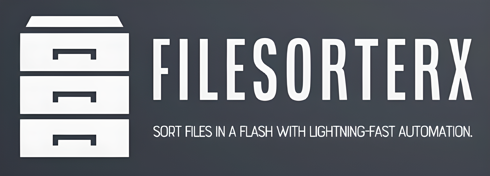
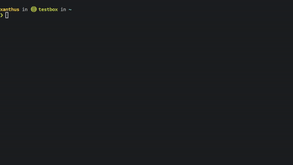

 

   
➡️
<a href="https://discord.gg/Kd7udvugQN">Discord</a> | 
<a href="https://github.com/Xanthus58/FileSorterX/wiki">Documentation </a>
 ⬅️

# Welcome to FileSorterX
### Sort files in a flash with lightning-fast automation.

## 📦 [Installation Guide](https://github.com/Xanthus58/FileSorterX/wiki/Installing-FileSorterX)
| 📦 Cargo                                   | 💾  Binary                                                         |
|-------------------------------------------|-------------------------------------------------------------------|
|  |                         |
| `cargo install FileSorterX`| [Release page](https://github.com/Xanthus58/FileSorterX/releases) |

# 🤔 What's FileSorterX

FileSorterX is a small command line application that automatically sorts files based on their file extension and places them into the appropriate folder. The application is written in Rust, which makes it very very fast. Only taking up to a second to sort over 10,000 files!. As well as being very reliable and efficient.

# 🎉 Features
- **Sorts thousands of files within a second?** ✔ 
- **Provides one of the best libs for file sorting?** ✔
- **Has A modern, easy and comfy cli interface?** ✔
- **Allows cli users to customize sorting locations?** ✔
- **Has a self updating feature; so you never have to worry about being out of date?** ✔
- **Provides a benchmarking tool so you can see how it performs for yourself?** ✔
- **Allows for logging and verbosity?** ✔
- **Saves you hours of time from sorting manually or programming one yourself?** ✔
- **Bakes you a cake?** ❌

# 💻 Cli First
FileSorterX is a powerful command-line interface (CLI) tool designed to help users automatically organize and sort their files. What sets FileSorterX apart from other similar tools is the separation between its library and the CLI tool. The library provides all of the core functionality like the creation and sorting of files. While the CLI tool serves as a convenient interface for users to interact with the library think of it as a cli wrapper. Although the primary focus is on the CLI application, the separation of the library and the tool ensures that users have the flexibility to integrate the sorting and organization functionality into their own projects or applications. With FileSorterX, users can easily manage and organize their files without having to spend hours doing it manually.

## Contributors

<!-- ALL-CONTRIBUTORS-LIST:START - Do not remove or modify this section -->
<!-- prettier-ignore-start -->
<!-- markdownlint-disable -->
<table>
  <tbody>
    <tr>
      <td align="center" valign="top" width="14.28%"><a href="https://xanthus.uk/"> <b>Xanthus</b></a> <a href="#ideas-Xanthus58" title="Ideas, Planning, & Feedback">🤔</a> <a href="https://github.com/Xanthus58/FileSorterX/commits?author=Xanthus58" title="Code">💻</a> <a href="#design-Xanthus58" title="Design">🎨</a> <a href="#maintenance-Xanthus58" title="Maintenance">🚧</a></td>
      <td align="center" valign="top" width="14.28%"><a href="https://github.com/FlameOrchid"> <b>FlameOrchid</b></a> <a href="https://github.com/Xanthus58/FileSorterX/commits?author=FlameOrchid" title="Code">💻</a> <a href="https://github.com/Xanthus58/FileSorterX/issues?q=author%3AFlameOrchid" title="Bug reports">🐛</a></td>
      <td align="center" valign="top" width="14.28%"><a href="https://github.com/WolfenXVII"> <b>Wolfen</b></a> <a href="https://github.com/Xanthus58/FileSorterX/commits?author=WolfenXVII" title="Tests">⚠️</a></td>
      <td align="center" valign="top" width="14.28%"><a href="https://github.com/okalm"> <b>okalm</b></a> <a href="https://github.com/Xanthus58/FileSorterX/issues?q=author%3Aokalm" title="Bug reports">🐛</a></td>
    </tr>
  </tbody>
</table>

<!-- markdownlint-restore -->
<!-- prettier-ignore-end -->

<!-- ALL-CONTRIBUTORS-LIST:END -->

This project follows the [all-contributors](https://github.com/all-contributors/all-contributors) specification. Contributions of any kind welcome!
